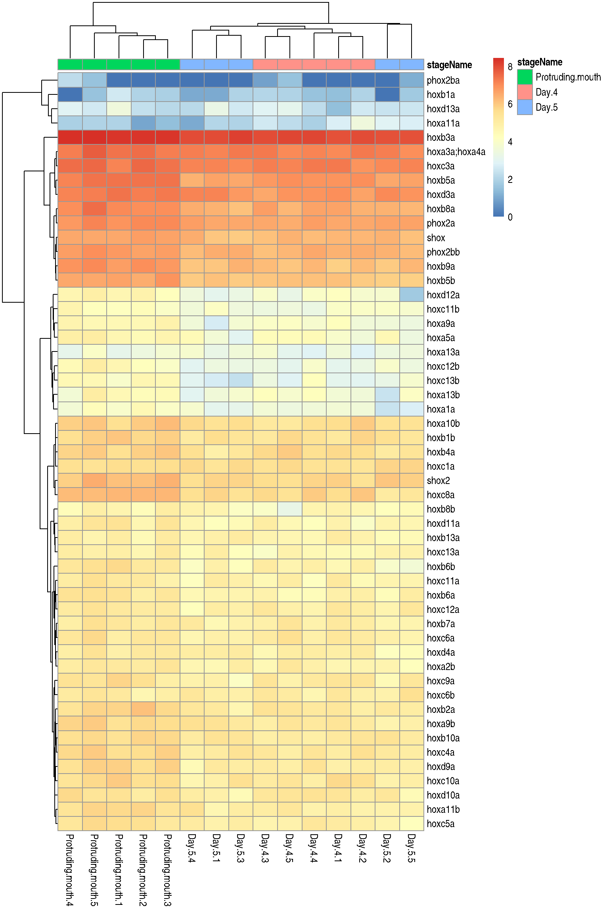
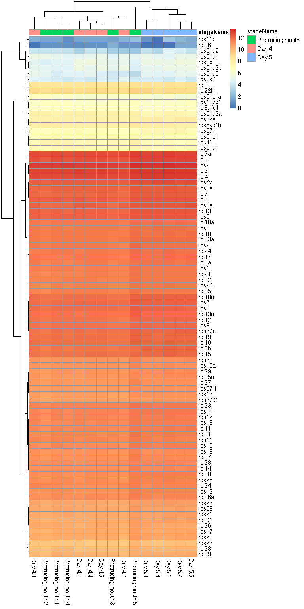
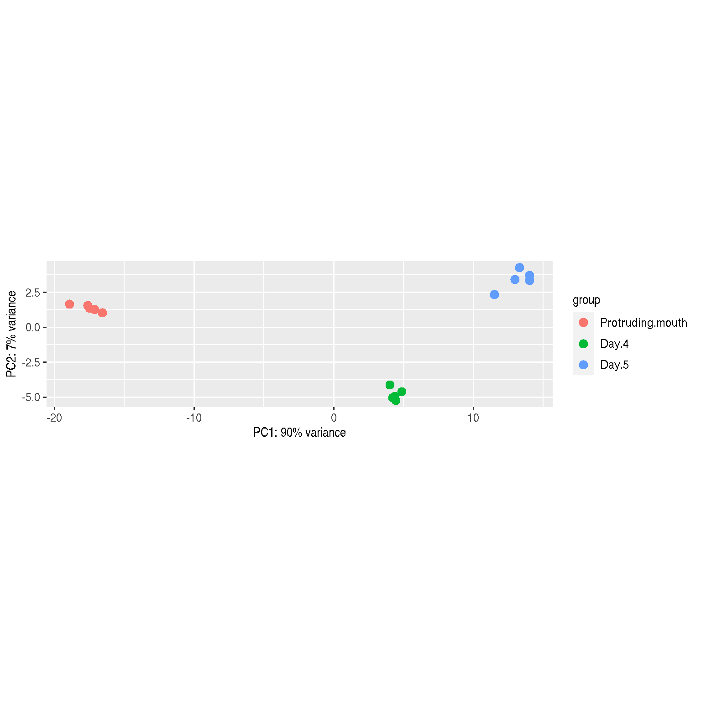
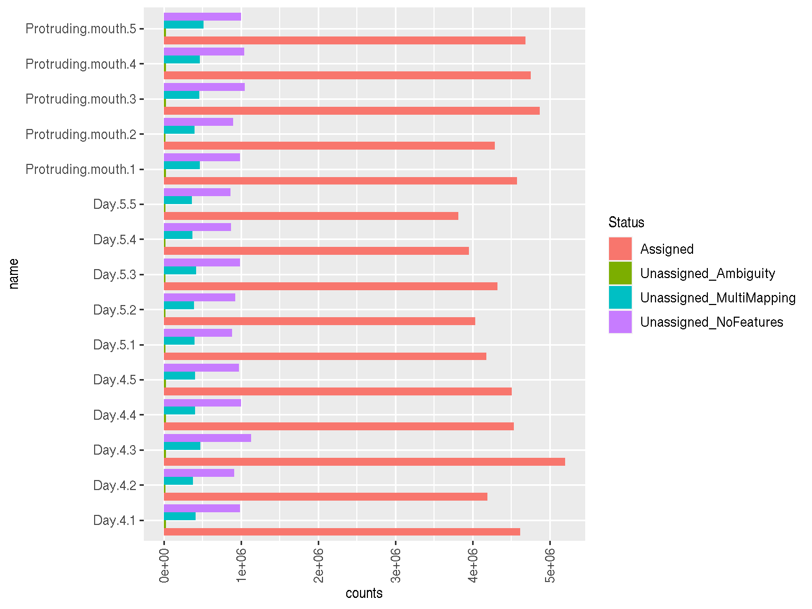
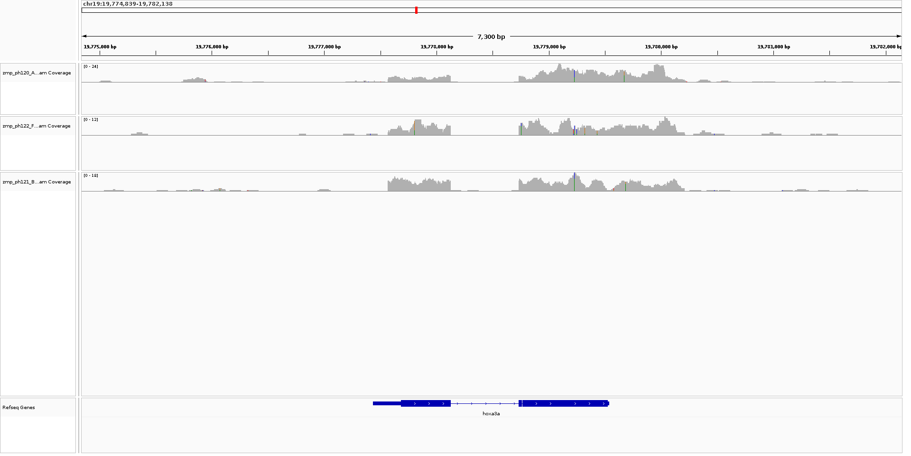

```{css, echo = FALSE}
/* Styles for YAML title, author and header  */
h1.title {
  font-size: 25px;
  color: DarkBlue;
  text-align: center;
}
h4.author { 
    font-size: 18px;
    text-align: center;
    color: DarkBlue;
}
h4.date { 
  font-size: 18px;
  text-align: center;
  color: DarkBlue;
}
/* Styles for other report elements  */
h1 {
  font-size: 24px;
  color: DarkBlue;
}
h2 {
  font-size: 20px;
  color: DarkBlue;
}
/* Table captions (header) */
caption {
      color: Black;
      font-size: 1.3em;
}
/* Figure captions (legend) */
p.caption {
  font-size: 1.3em;
}
```
```{r setup, message=F, warning=FALSE}
library(DESeq2)
library(knitr)
```

# Introduction

This specific dataset analyzed is selected samples from the paper, *"A high-resolution mRNA expression time course of embryonic development in zebrafish".*^[A high-resolution mRNA expression time course of embryonic development in zebrafish, White et al., (2017)  *eLife* (https://elifesciences.org/articles/30860#content)] Specifically, the samples selected were of all samples of three specific time points of the total RNA captured by pooled zebrafish embryos, Protruding Mouth, Day-4, and Day-5. Day 4 and Day 5 are the last two time points of thier timecourse, while Protruding mouth is strictly in the middle with more than a few timepoints in between the Protruding Mouth and Day 4.  I hypothesized that in embryogenesis, I expect to see more and more differentially expressed genes within the HOX gene family and other cell differentiation genes with respect to earlier timepoints.

## Biological Background

HOX genes are known to play a fundamental role in the morphogenesis of the vertebrate embryo, providing cells with regional information along the main body axis.^[Homeobox Genes in Embryogenesis and Pathogenesis, Mark et al., (1997) *Pediatric Research*  (https://www.nature.com/articles/pr19972506)] For zebrafish specifically, Hox genes are implicated in conferring regional identity to the anteroposterior axis of the developing embryo, and as such, we should expect differentiation of HOX expression as the vertabrae in the embryo develops.^[Zebrafish hox genes: genomic organization and modified colinear expression patterns in the trunk, Prince et al., (1998) *Development* (https://pubmed.ncbi.nlm.nih.gov/9425136/)]

## Personal Interest

I was personally interested in working with a new model organism that I have not worked in and running the DESeq2 method onto the samples. Most of my work is with mouse models of some form of Ctrl vs Treatment set up using a predefined pipeline using EdgeR. I thought it would be interesting to work with a developmental embryo, where we should expect to see highly differentiated gene expression across days as parts of the embryo/larvae is being defined/grown. I've always been interested in learning more about embryo development, so this was a perfect chance to learn more. 

Here I wanted to work with a new type of model organism I have not worked with, which led me to *danio rerio*. Zebrafish are commonly used in embryo and vertebrae development, and as such, they are a perfect model to use here.^[Zebrafish: Development of a Vertebrate Model Organism, J Meyers, (2018) *Current Protocols* (https://currentprotocols.onlinelibrary.wiley.com/doi/abs/10.1002/cpet.19)] I thought it would be interesting to work with a less common model organism, as when compared to mice and humans, zebrafish should be less clearly annotated, and this will present unique and unusual challenges to solve.

I have worked with rats as a model organism before, and I remember that being a struggle to deal with, so I thought it would be fun to see what difficulties will arise when working with zebrafish data, as it should also be less well annotated than human/mice. Embryogenesis does come with its own host of issues, including the issue of lack of genetic material when compared to a mature host, so I was also interested in seeing if this would cause problems on my downstream analysis.

# Results

From the results, we do actually see large variabilities between the timepoints, and these results were especially exacerbated when comparing the Day 4 and 5 samples against the Protruding Mouth timepoint. 

## Figure 1 Overall DEG Expression

```{r Figure1, fig.show='hold',fig.height=28, fig.width=28, fig.cap = "Figure 1. Volcano Plots of DEGs for the three contrasts: 4vM, 5vM, and 4v5", out.width="32%",out.height="95%", echo=FALSE}
knitr::include_graphics(c("./outputs/volcano4vM.png", "./outputs/volcano5vM.png",
                        "./outputs/volcano4v5.png"))

```

Volcanoplots were generated using EnhancedVolcano using the DEGs from the three contrasts using the default logFC and Pvalues. We see here that the 4vM and 5vM volcano plots look somewhat similiar in that there are many genes that carry over in terms of differential expression. The 4v5 plot meanwhile introduces some new genes that were not previously seen before, but genes like cyp3a65 still remains at the top of the 4v5 plot, meaning that this gene actually peked on Day4 and it's overall expression decreased on the fifth day. These genes seem to be somewhat all over the place in terms of function. Cyp3a65 is a membrane marker for structures, Ctrl is a chymotrypsin like protein involved in proteolysis, and is expressed in the pancreas, and ela genes (like [elastase2](https://zfin.org/ZDB-GENE-041117-1)) are predicted to have serine-type endopiptidase activatty and localizes in extracellular space.^[ZFIN database]

## Figure 2 HOX Gene Expression

From all of this, it is noticeable that we did not see any of the HOX genes as the top differentially expressed genes as I originally hypothesized. Here I looked specifically into the HOX genes using a basic grep search of `hox` and then plotted the heatmap of the norm Transformed counts. For the exact code on what was performed: this was stored in the [DESeqAnalysis](DESeqAnalysis.html).

```{r Figure2, fig.show='hold',fig.height=28, fig.width=28, fig.cap = "Figure 2. Heatmap of HOX Expression",out.height="99%", echo=FALSE}

```

Here we see that the the samples for day 5 did actually not cluster together, meaning their is some heterogeneity in the HOX expression of the samples on the 5th day. Overall however, you do see a somewhat distinct expression of Protruding Mouth vs the day4/5 timepoints where there are clear differences in HOX expression, where it seems that the earliest time point measured actually has overall more HOX expression. Here I also plotted all individual HOX gene counts across groups along with their pvalues as long as if one of their pvalues for that gene across groups was <0.05. I displayed some of these individual gene plots with their normalized counts below.

```{r Individual HOX plots, fig.height=28, fig.width=28, fig.show='hold', out.width="49%", out.height="95%", echo=FALSE, fig.cap = "Figure 2 Supp. Individual HOX norm Count Plots"}
knitr::include_graphics(c("outputs/hoxc8ahoxc4a.png", "outputs/hoxc12bhoxc13b.png"))
```
Most of the HOX genes follow this trend where we do see a decrease across time from Mouth to day 5. Other plots were stored in the "hox_gene_plots.pdf". Plots were generated using DESeq's `plotCounts` with an addition of the gene name instead of gene ID, along with adj Pvalues of the gene with respect to its contrast. (4v5 is day 4 vs 5, 4vM is day 4 vs Protruding Mouth, and 5vM is Day 5 vs Protruding Mouth) Commands used to generate these figures are stored in the DESeqAnalysis's `HOX gene exp plots` portion (line 148-174).


## Figure 3: GSEA Reactome Pathways

I was curious on the overall reactome pathways being expressed at each timepoint, as from my initial view into the volcano plot, I saw a smattering of genes expressed all over the place. Here I wanted to see the overall trends in the embryo and what was being expressed

```{r Figure3, fig.show='hold',fig.height=28, fig.width=28, fig.cap = "Figure 3. GSEA c2.Reactome: 4vM, 5vM, 4v5", echo=FALSE}
knitr::include_graphics(c("./outputs/GSEA4vM.png", "./outputs/GSEA5vM.png",
                        "./outputs/GSEA4v5.png"))

```

We see again that we do have some crossover between overall gene set enrichments for all of the contrasts. For example `Reactome The role of GSTE1 in G2 M Progression After G2 Checkpoint` gene set was negatively enriched in both the Day5vsMouth and Day4vsDay5. This gene set is known for its role in G2 to M transitions which will occur at a higher rate as the body begins to divide. We should expect to see an increase cell division as more cells reach maturity. Other shared pathways like `Bile acid and bile salt metabolism`, involve genes that supposedly play roles in cholesterol homeostasis. 

A deeper dive into what genes are enhanced in the top 20 pathways by NER, we find that there is heavy overlap of the genes across these pathways. For example, we find heavy overlap of Proteosome genes for the all of the groups in the Day4vsMouth + Day5vsMouth, where 17-19 of the top pathways for each respective contrast included Psmd* and Psmb* genes in their pathways, signifying that these genes are playing a large role in the overall overlap in high enrichment scores. On the other hand the Day4vsDay5 pathways included a large number of ribosomal expression, meaning a shift in ribosomal expression is also playing a role in gene expression especially for Day4vs5. 

Plotting just the Ribosomal Genes:

```{r ribosomal expression, fig.height=28, fig.width=28,out.height="99%", echo=FALSE, fig.cap = "Figure 3 Supp. Exploring Ribsomal Counts Driving Day 5 NES"}

```

We do see that Day 5 across the board does seem to have a higher ribosomal count compared to the other samples, and they do cluster together. What is hard though is to determine whether this is biological or technical error. There was overall less total gene capture for the day 5 sample when compared to the other time points, and we cabnnot be certain if we are just capturing a baseline amount of ribosomal counts which now hog more of the overall expression, or perhaps that the pooled samples did not capture total the total embryonic transcriptomic signature.

## Limitations

So there was a number of issues that I ran into when dealing with the data:

1. The data is actually total RNA instead of poly A enriched mRNA, which I was really only interested in, meaning some of the data was wasted and not analyzed.
2. There are not a lot of reads that aligned overall, with ~5M reads being assigned to features for each sample, which will reduce power for much of the analysis.
3. 5 replicates for each day limits the total power as well of the experiment.
4. I was unable to access the totality of the dataset, and instead worked with just three of the timepoints available, when there were 18 overall.
5. The timepoints selected are not an even split of time or developmental stages as day 4 and 5 are the last two timepoints of their experiment, while protruding mouth is somewhere closer to the middle.

These limitations do reduce the power of this experiment and does limit any conclusion being made as we just lack the genetic material to make large conclusions even with the large variabilities between the timepoints, as some of the variability could be just due to the lack of saturated sequencing depth or overall sequencing expression at that time point. 

## Conclusions

From this analysis, we do see that with respect to DEGs, the time points are different, and the earliest timepoint for my analysis, Protruding Mouth, was especially different when compared to the last two timepoints. The Hox family does seem to play a role in differentiation, but by Day-5 we saw that the overall gene expression of the  was significantly down when compared to the first timepoint. Further analysis of the in between timepoints could give us a better understanding of this decrease in the curve over time. Finally, the GSEA does further confirm that there is a variety of genes that are playing a role in this differentiation. However for the most significantly enriched pathways, many are overlapping and draw heavily from the same gene families like Proteosome expression, or in the case of day 5 vs day 4, a marked increase in ribosomal expression, which may be due to its smaller size factor bias. 

Overall, I have a hard time trying to make any concrete conclusions, as I am a little nervous with the lack of depth across basically every gene. I am much more used to seeing gene counts in the the hundreds to thousands, while most of these genes counts are relatively sparse, with the largest gene counts being in the hundreds. Small variability in gene expression at low counts lead to higher variability and can lead to biased results and logfoldchanges. However, taking into account the data and understanding that embryo transcriptomic expression is always much smaller than full grown mouse models, I do believe that these three timepoints do show potential that there are clear gene groups that do help define and express certain portions of an embryo's development.


# Methods

## Pre-Processing Steps:

1. Files were downloaded via ftp using the ENA project ID of PRJEB12982. From here we selected three days of files that did fully download, Protruding-Mouth, Day-4, and Day-5. (I kept running into an issue where every other file was failing to download, and as such not all the files for each sample would download. Here I had to preselect for complete groups, and this is what I ended up with. I believe it was some type of error with one of their download nodes. I attempted this a few times across a week or two, and there were no large changes unfortunately.)
2. Each sample's fastq reads were merged into their respective paired ends (R1, R2), and the samples were trimmed for adapters using trimgalore with Illumina adapters (as the samples were using TruSeq Adapters). Fastqc was also ran here
3. Samples were then aligned with STAR with mostly default parameters. (One change in outFilterMultimapNmax @ 4. We use this at our core. I'm not sure if this makes a large difference at all, but could be tested eventually.)
4. Bamqc was ran.
5. MultiQC was ran on the collected fastqc outputs.
6. Features counts were ran with the paired end option `-p` and `-s 2` after glancing into the outputs (where we see that the reverse strand led to higher assignment)

## DESeq Analysis

Here we looked into the QC. In these steps we looked at the feature counts summary plot, gene body coverage, along with a basic rlog'd PCA of the object. Code to generate these figures are included in the [qc_processing.Rmd](qc_processing.html), along with other plots generated that glanced more into the QC. To mention, the samples all had around 44-45% GC content across the board. These samples were all pooled and each sample is a technical replicate. From our glance into our samples we also realize that many of the reads did not fit into our transcripts as they have binded to UTR regions.
```{r QCfigure_p1, fig.height=8, fig.width=28,out.height="99%", echo=FALSE}

```
```{r QCfigure_p2, fig.height=28, fig.width=28,out.height="99%", echo=FALSE, out.width="49%"}
knitr::include_graphics(c("outputs/sizefactorvsgroup.png", "outputs/genebody.geneBodyCoverage.curves.jpeg"))
```
```{r QCfigure_p3, fig.height=28, fig.width=28,out.height="99%", echo=FALSE, fig.cap = "QC report"}

```

From this we do see that that the data is relatively sparse as we only have ~5M reads per sample, but the samples are highly variable as we see a clear differentiation in the first PC across all our sample groups, meaning the majority of the transcriptional change that was captured is along our timecourse. The gene body coverage plot does display the expected genebody coverage as this not polyA enriched library prep, so we will not see the typical 3 'end bias. We do see some size factor bias scaling with the 5 day time point. It seems these samples also had the least number of total reads, which translated into features assigned and now a factor bias. This is definitely non-trivial as we already are pretty low on reads as it is.

To add on this, we do have a decent number of unassigned features (~10-20% of total reads). More work can be done to assign them, as in the original paper's protocol, they looked at lincRNA and miRNA for these total RNA samples, but this would require further alignment work. Taking a glance into IGV to see what could these no assignment features be... 

```{r QC_figure_p4, ig.height=28, fig.width=28,out.height="99%", echo=FALSE, fig.cap = "QC IGV Hoxa3a"}

```

Looking at the `Hoxa3a` gene we clearly see that some reads are part of the UTRs, with some reads being located in and around the promoter and also after the termination codon of the gene. This is due to the factthat this is a total RNA capture, meaning we should expect to see some capture of non-mRNA RNA. More work could have been done here to assign and save these reads, but as my question mostly focused on the change of HOX gene expression across these timepoints, I did not deem it essential to align the non-transcriptomic reads.

(All code for this portion can be found in `qc_processing` lines 54-161. Outputs from this qc is saved in the outputs folder as the separate dds.rds files. The multiqc reports can be found in the outputs folder in the github repository.)

## DEG discovery

DEG discovery followed the Michael Love DESeq2 vignette, where we ran the steps as recommended by the creator:

1. DESeq()
2. results()
3. LFCShrink()

The contrasts were split into three separate experiments and ran separately. For LFCShrink we used `ashr` as our shrink method instead of normal as it has been shown to perform better than the `normal`. All steps were performed in `DEAnalysis` (lines 6-44). We also plotted our Dispersion estimates to see how our model performed on our data across all three samples, where we did not see any obvious issues (lines 52-56).

## GSEA

Figures were generated using fgsea and msigdbr. Here I used msigdbr to grab the `c2:cpReactome` pathways for zebrafish. There I generated a map for gene names, converted the results outputs for each contrast into fgsea compatible data, mostly following Turner's [blog](https://stephenturner.github.io/deseq-to-fgsea/) by using the mean Wald Stat.^[DESeq results to pathways in 60 Seconds with the fgsea package, Stephen Turner, 2018] This is a relatively large change as many people will use the `sign(logfc)*log10(pvalue)` as their enrichment score instead. This can be found in lines 202-309 of the `DESeqAnalysis` report. Here I selected the top 20 enriched sets up and down for each contrast via the total NES score and selected a pvalue filter of 0.05 for each gene enrichment. 

## Heatmaps

Heatmaps were generated via `pheatmap`. Both figures were generated via a grep search for the specific genes in question (hox* for hox and ^rps[0-9]|^rpl[0-9] for ribosomal genes). From there the samples were relabeled using the symbol names instead of ensembl IDs to improve interpretability. Samples were column and row clustered to better understand how the samples cluster against each other with respect to the genes in question.


## Dataset Manipulation

Glancing into our DESeq dataset object:

```{r, summarytable, echo=FALSE}
dds = readRDS("outputs/dds.rds")
kable(colData(dds), caption = "Table 1. Dataset Object and Column Features", format = "markdown")
```
Row data cleaning was performed to remove the 1 to many mappings for the gene symbols and zmp. These steps are found in qc_processing using biomart to grab the gene names. Gene names that mapped to the same gene id were concatenated using a semicolon, as I am unsure which gene name is "more" correct. (I love data cleaning!!)

I used stageName as the factor for my groups. In order to perform pairwise contrasts I split the dataset into the three contrasts, and releveled as needed during further steps. 

```{r rowsummary, echo=FALSE}
kable(head(rowData(dds),n=50), caption = "Table 2. Row Data features and Cleaning", format = "markdown")
```

There are a lot of unknown symbols for many of these IDs. I still kept them for the majority of the time, as it would feel bad to remove them. However, all labeling for genes were made using symbols for all downstream analyses by incorporating the `SYMBOL` label as factors for my heatmaps, volcano plots, GSEA and individual gene plots.

# Discussion

## The Good

Overall I think working with the dataset was a good experience. I have never done anything using DESeq2 , so analyzing the output and working in the `SummarizedExperiment` class was a good experience along with working with a new model organism. We do see that there are some clear differentiation between the timepoints and some of this can be attributed to the HOX genes, but the most significant genes for all contrasts were not HOX at all but more of a variety of different genes. I don't really have a strong enough biological background to really interpret those results beyond just exploring the genes one by one, so this would be a point where I would need to discuss with collaborators.

## The Bad

As explained briefly in the limitations, I actually really struggled with data download, as there were much more timepoints available to download, so I would have actually liked to have a few more timepoints when doing the analysis. Unfortunately, this was not possible. Specifically, we do see from earlier research that they did see HOX differentiation occur particularly in the anteroposterior, and getting the timepoint where this occurs exactly would have been fun to look at... Unfortunate. This lack of timepoints also removes capabilities of running this as a time course using `fission` and the examples run by Michael Love in his [vignette](http://master.bioconductor.org/packages/release/workflows/vignettes/rnaseqGene/inst/doc/rnaseqGene.html).^[RNA-seq workflow: gene-level exploratory analysis and differential expression, Love et Al., (2019)]

Second, power will be an issue with almost all of this analysis. We simply do not have a huge number of reads, and with almost 20% not being assigned to a gene, we lose a lot of support, and we shouldn't make any strong claims beyond what things that are obvious. This limitations may not even be solved with more sequencing, as the multiqc report does already have ~20% duplication rate as well, meaning we may be capturing the totality of the gene signature at these timepoints. This is probably something that could be clarified with a deeper dive into expected transcriptional signatures of embryos/larvae, as we should not expect large transcriptional signatures. 

The replicates are already pooled samples, which means that the signature of each replicate is actually the combined signal of the samples. Each sample instead serves as a technical replicate of each other; we should and did see mostly homogeneity as they are derived from the same pooling of the samples, but we still did see some heterogeneity across the same group. (I.E. the Day5 samples did not cluster together with respect to the HOX gene expresiion.)  More biological samples and technical replicates could help solve this issue. 

Finally, alignment of the non-transcriptome RNAs and assignment of these promoter region and intron RNAs would also be a way to improve this analysis. Recovery of the ~1M or so unassigned/no Feature reads could improve downstream analysis, but this would require some more reading/a better understanding of what to do with them on my part on how to deal with those reads.

Also, the annotation of this species is kind of silly. There are multi-to-multi mapping for gene symbols to gene ids everywhere. There are multiple genes mapped to the same gene id, and also multiple mapping of gene ids to various genes, which is a whole host of issues. I initially rectified this by combining the gene symbols together for each id, but I am unsure if this was the right solution here.

# Data Availability
Data and scripts used for this pipeline can be found here:
[Link](https://github.com/MaxLChao/RNASeq_pipeline.git)

## Data Descriptions

*In outputs:*

| data           |                      description |
| ---            |                              --- |
| dds.rds        | non-split 3 timepoints DESeq obj |
| dds4v5.rds     | 4v5 timepoints DESeq obj         |
| dds4vM.rds     | 4vM timepoints DESeq obj         |
| dds5v5M.rds    | 5vM timepoints DESeq obj         |

*In metadata:*

metadata for the ENA project. These files were used by scripts to call and download files as well as initial annotations

*scripts:*

Preprocessing scripts to download and process the data

*Reports:*

final_report: description of project, thoughts and conclusions
qc_processing: all qc and data pre processing steps
DESeqAnalysis: DESeqAnalysis for DEGs and GSEA.


```{r, knitrReport, echo=FALSE}
knitr::knit_exit()
```