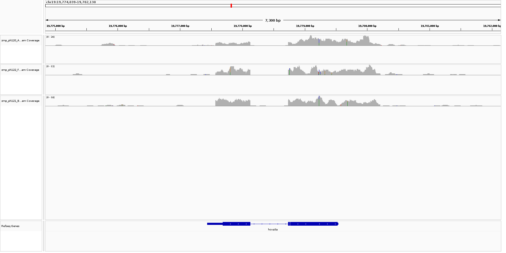

```{r setup, include=FALSE}
knitr::opts_chunk$set(echo = TRUE)
```

## QC Report

Overall it seems that the samples were all of good quality and less than 25% duplication rate. These samples were pre-trimmed using trimgalore, and then aligned. We do not have a lot of reads (5-7M) per sample, so the power of this experiment will be relatively low. I will be mainly concerned with differential hox expression, so hopefully we see that?

So for the most part MultiQC does seem to fail all samples for GC content as most of the samples are below 50%. However it is uniform across all samples. The data itself is not going to be obviously of the highest quality as we are working with hundreds to low thousands number of cells per embryo, meaning total RNA capture will be capturing whatever we can get.  I think that due to the homogeneity of this bias, it's probably okay to work with it with the caveat knowing we should not expect even capture of all genes equally. (Also expected as these are embryoes, and not all genes will be expressed during development.) We should expect homogeneity as well due to the way the samples are prepped via pooling of embryoes, meaning that the samples are actually technical replicates of the same pooling of samples. This pooling is essential as the a single embryo's genetic signatures would be quite sparse especially at the earlier timepoints of their timecourse.


## Loading in feature counts

```{r,message=FALSE,warning=FALSE}
library(org.Dr.eg.db)
library(magrittr)

feat_counts = read.table("outputs/zebra_counts.txt", header = TRUE)
# let's convert the colnames into something more legible
metadata_table = read.table("metadata/elife-30860-supp1-v1.tsv", header = T)
metadata_names = metadata_table[grep("zmp_ph12[0-2]_[A-H]$", x=metadata_table$sample),] %>%
  .$sampleName %>% gsub(pattern = "-", replacement = ".")

colnames(feat_counts) =c(colnames(feat_counts)[1:6], metadata_names)

# getting gene symbols in
row_dat = select(org.Dr.eg.db, keys = feat_counts$Geneid,
  columns = c('ENTREZID', 'SYMBOL', 'ENSEMBL'),
  keytype = 'ENSEMBL')
# will store this in the rowdata
dup_ids = row_dat$ENSEMBL[which(duplicated(row_dat$ENSEMBL))] %>% unique()

# flattening to fit into row dat
f_row_dat = row_dat
for (x in dup_ids){
  sub = f_row_dat[which(f_row_dat$ENSEMBL == x),]
  f_row_dat$ENTREZID[which(f_row_dat$ENSEMBL == x)[[1]]] = paste(sub$ENTREZID, collapse = ";")
  f_row_dat$SYMBOL[which(f_row_dat$ENSEMBL == x)[[1]]] = paste(sub$SYMBOL, collapse = ";")
  f_row_dat = f_row_dat[-(which(f_row_dat$ENSEMBL == x) %>% .[-1]),]
}
dim(f_row_dat)
dim(feat_counts)
```

## QC

```{r checking the quality, message=FALSE, warning=FALSE}
library(ggplot2)
sum_f_class = read.table("outputs/zebra_counts.txt.summary", header = TRUE)
colnames(sum_f_class) =c(colnames(sum_f_class)[1], metadata_names)

sum_f_class = sum_f_class[lapply(1:nrow(sum_f_class), function(x){
  sum(sum_f_class[x,-1]) >0
}) %>% unlist(),]

fl_reads = lapply(2:ncol(sum_f_class), function(i){
  Status=sum_f_class$Status
  name=colnames(sum_f_class)[i]
  counts=sum_f_class%>%as.data.frame()%>%.[,i]
  df = cbind(Status, name, counts)
}) %>% do.call(rbind,.) %>% as.data.frame()
fl_reads$counts = as.numeric(fl_reads$counts)
ge=ggplot(fl_reads, aes(x=name, y=counts)) +
  geom_bar(aes(fill = Status),stat = "identity",position = "dodge") +
  coord_flip()  +
  theme(axis.text.x = element_text(angle = 90, vjust = 0.5, hjust = 1)) 

```


### QC Feat Counts summary plot

```{r the plot, fig.width=8, fig.height=6,echo=FALSE}
ge

```

We don't have too much reads to due these being embryos, but it will have to do. Decent number of unassigned features, which also may be expected due to the data containing total RNA. In their actual processing script, they performed novel transcript mapping to find novel genes, and discovered 127 novel genes. We did not do this here as we are using a much newer build of the genome, which included their additions. Another thing that was not taken into account was the fact that this was total RNA which can contain miRNAs, lincRNAs, and other RNA stored. We will probably see a decent number of these fragments either multimapped either to shorter lengths, or no features if they do not line up with known transcripts. We find that ~1M reads for each samples did not align to a transcript, likely meaning they are not typical mRNA.


## Gene Body Coverage plot

```{genebodycoverage, eval=FALSE, echo=FALSE}
geneBody_coverage.py -i files.txt -r daniorer11.ensemblgenes.nochr.bed -f 'jpeg' -o genebody
#where files.txt is a list of the bam files after sort and index

```

```{r genebodycov_vis, fig.height=28, fig.width=28, fig.show='hold', out.width="49%", out.height="95%", echo=FALSE}
knitr::include_graphics(c("outputs/genebody.geneBodyCoverage.curves.jpeg","outputs/genebody.geneBodyCoverage.heatMap.jpeg"))
```

Looks about right as these are not poly A enriched, so we do not have the heavy 3' end bias we would normally see for poly A enriched mRNA.

## Visualizing one of the BAMs
Here I just wanted to look at one of the genes for a few BAMS via IGV just to see what is there. Looking into it hox3a3...

```{r knitrigv, fig.height=12, fig.width=12}

```

Here we do see that there is actually some reads capturing not just the exons, but we seem to be capturing around the genes as well. I'm sure Merv would have a good time looking into the UTRs that do have some expression as we are getting some probably before and around the promoter, as well as after the gene. 

## Processing

```{r intoDeSeq, message=FALSE,warning=FALSE}
library(DESeq2)
coldat= metadata_table[grep("zmp_ph12[0-2]_[A-H]$", x=metadata_table$sample),]
coldat$stageName = gsub(coldat$stageName, pattern = "-", replacement = ".")
coldat$stageName = as.factor(coldat$stageName) %>%  relevel(., ref = "Protruding.mouth")
dds = DESeqDataSetFromMatrix(countData = data.frame(feat_counts[,-(2:6)]),
                             colData = coldat,
                             design = ~ stageName,
                             tidy = T)
rowData(dds) = f_row_dat
dds=dds[-which(rowSums(counts(dds))==0),]

# Size factor
dds <- estimateSizeFactors(dds) # calculate SFs, add them to object
plot(x=sizeFactors(dds), y=colSums(counts(dds)), col=factor(colData(dds)$stageName), # assess them
ylab = "library sizes", xlab = "size factors", cex = .6 )
legend("topleft",
       legend = levels(factor(colData(dds)$stageName)),
       pch = 19,
       col = factor(levels(factor(colData(dds)$stageName))))
```


Ok... pretty linear. Some issues with size factor as day 5 seems to be smallest.   

```{r comparing counts, figures-side, fig.show="hold", out.width="50%"}

par(mfrow=c(1,2))
## extracting normalized counts
counts_sf_norm <- counts(dds, normalized=TRUE)
## adding the boxplots...

boxplot(log2(counts(dds)+1), notch=TRUE,
main = "Non-normalized read counts",
ylab="log2(read counts)", cex = .5, xaxt="n", col=factor(colData(dds)$stageName))

boxplot(log2(counts_sf_norm+1), notch=TRUE,
main = "Size-factor-norm-ed read counts",
ylab="log2(read counts)", cex = .5,xaxt="n", col=factor(colData(dds)$stageName))

```

Not sure it shows much a difference all things considered, but we do see some more normalization with the means for the boxplots in the second one.


```{r rlogpca, fig.show='hold', fig.width=8, fig.height=8}
rlog_dds=rlog(dds)
plotPCA(rlog_dds,intgroup="stageName")
```

Ok. That's actually really nice. We clearly are getting a nice differentiation of samples with respect to each other and also with respect to the time course. (Protruding-Mouth is a stage before day 4 and 5). So ~90% of the variance with respect to these samples and their low counts are due to "treatment"/time course difference. 

```{r savedds}
dds1 = dds[,grep(pattern = "Day.4|Protruding.mouth", colnames(dds))]
dds2 = dds[,grep(pattern = "Day.5|Protruding.mouth", colnames(dds))]
dds3 = dds[,grep(pattern = "Day.5|Day.4", colnames(dds))]

saveRDS(dds1, "outputs/dds4vM.rds")
saveRDS(dds2, "outputs/dds5vM.rds")
saveRDS(dds3, "outputs/dds4v5.rds")
saveRDS(dds, "outputs/dds.rds")
```
